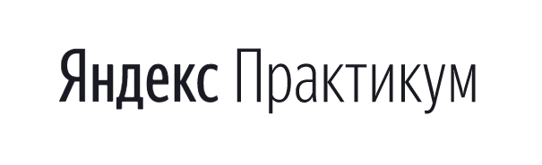

# Проект 3: Путешествие по России

### Описание:
Учебный проект выполненный в рамках проектной работы по адаптивной вёрстке в котором
представлены некоторые из многочисленных достопримечательностей России :
- Куршская коса
- Кольский полуостров
- Алтай
- Байкал
- Карелия

Проект содержит полезные ссылки по рассмотренной теме.

Разработан в рамках изучения темы "Адаптивная вёрстка и работа с макетом" при
прохождении курса Web-разработчик от Яндекс.Практикум

При написании сайта использованы технологии:
- HTML
- CSS (Флексбокс-вёрстка, вёрстка на Грид, Позиционирование элементов, Анимации и трансформации)
- Методология БЭМ

### Ссылка на проект

#### __Сергей Литвиненко__
#### **_19/02/2022_**

# Проект 3: Traveling in Russia

### Description:
Учебный проект выполненный в рамках проектной работы по адаптивной вёрстке в котором
представлены некоторые из многочисленных достопримечательностей России :
- Curonian Spit
- Kola Peninsula
- Altai
- Baikal
- Karelia

Проект содержит полезные ссылки по рассмотренной теме.

Разработан в рамках изучения темы "Адаптивная вёрстка и работа с макетом" при
прохождении курса Web-разработчик от Яндекс.Практикум

In creating of this website, the following technologies were used:
-	HTML
-	CSS (flexbox, grid, elements’ positioning, animation and transformation)
-	BEM methodology

### Project link

#### __Sergey Litvinenko__
#### **_19/02/2022_**

